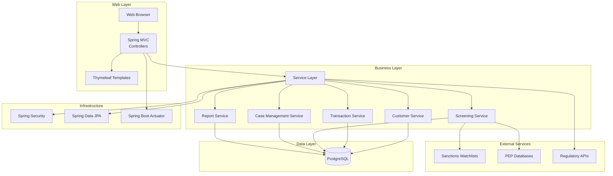

# AML Compliance Application

## Purpose

Anti-Money Laundering (AML) compliance application designed to help financial institutions detect, prevent, and report suspicious financial activities in accordance with regulatory requirements.

## Features

### Core AML Functions
- **Customer Due Diligence (CDD)**: Identity verification and risk assessment
- **Transaction Monitoring**: Real-time suspicious activity detection
- **Sanctions Screening**: Watchlist checking against PEPs and sanctions lists
- **Case Management**: Investigation workflow for flagged transactions
- **Regulatory Reporting**: Automated SAR/STR generation and filing

### System Features
- **Risk Scoring**: Automated customer risk classification
- **Alert Management**: Dashboard for monitoring and investigating alerts
- **Audit Trail**: Complete transaction and activity logging
- **Compliance Dashboard**: Real-time metrics and reporting
- **User Management**: Role-based access control

## Architecture



## External Services & Regulatory Integration

```mermaid
graph TB
    subgraph "AML Application"
        A[Spring Boot AML App]
        B[(PostgreSQL DB)]
    end

    subgraph "Indonesian Regulatory Services"
        C[PPATK API<br/>LTKM Reporting]
        D[OJK API<br/>Compliance Reporting]
        E[Bank Indonesia<br/>Regulatory Data]
    end

    subgraph "International Watchlists"
        F[FATF Database]
        G[UN Sanctions<br/>Consolidated List]
        H[OFAC Sanctions<br/>List]
        I[Interpol Notices]
    end

    subgraph "Commercial Data Services"
        J[PEP Database<br/>Politically Exposed Persons]
        K[Adverse Media<br/>Monitoring Service]
        L[Identity Verification<br/>Service]
        M[Geolocation<br/>Risk Service]
    end

    subgraph "Financial Institutions"
        N[Banking Systems<br/>Transaction Data]
        O[Payment Processors<br/>Transaction Flow]
        P[Digital Wallets<br/>Crypto Transactions]
    end

    subgraph "Government Agencies"
        Q[Tax Authority<br/>Data Exchange]
        R[Law Enforcement<br/>Requests]
        S[Customs<br/>Trade Data]
    end

    A --> C
    A --> D
    A --> E
    A --> F
    A --> G
    A --> H
    A --> I
    A --> J
    A --> K
    A --> L
    A --> M
    A --> N
    A --> O
    A --> P
    A --> Q
    A --> R
    A --> S

    style A fill:#e1f5fe
    style C fill:#fff3e0
    style D fill:#fff3e0
    style E fill:#fff3e0
    style F fill:#f3e5f5
    style G fill:#f3e5f5
    style H fill:#f3e5f5
    style I fill:#f3e5f5
```



## Technology Stack

### Backend
- **Java 21**: Primary programming language
- **Spring Boot 3.x**: Application framework
- **Spring MVC**: Web layer
- **Spring Security**: Authentication and authorization
- **Spring Data JPA**: Data persistence
- **Thymeleaf**: Server-side templating engine

### Database
- **PostgreSQL 17**: Primary database (via Docker)
- **Testcontainers**: Automated testing with Docker containers
- **Flyway**: Database migration management

### Build & Dependencies
- **Maven**: Build automation and dependency management
- **Spring Boot DevTools**: Development productivity tools
- **Docker**: Database containerization

### Monitoring & Operations
- **Spring Boot Actuator**: Application monitoring
- **Logback**: Logging framework

## Setup Instructions

### Prerequisites
- Java 21 or later
- Maven 3.8+
- Docker & Docker Compose
- Git

### Application Configuration
1. Clone the repository
2. Start database: `docker-compose up -d postgres`
3. Run the application: `mvn spring-boot:run`

### Access Points
- Application: `http://localhost:8080`
- Actuator endpoints: `http://localhost:8080/actuator`

## Security Considerations

- All sensitive data encrypted at rest and in transit
- Role-based access control for compliance officers
- Complete audit trail of all user actions
- Regular security updates and vulnerability scanning

## Compliance Standards

### International Standards
- **Bank Secrecy Act (BSA)**: [FinCEN BSA Requirements](https://www.fincen.gov/bank-secrecy-act)
- **USA PATRIOT Act**: [US Department of Treasury](https://home.treasury.gov/policy-issues/financial-sanctions/counter-terrorism-sanctions)
- **EU AML Directives**: [EU AML/CFT Framework](https://ec.europa.eu/info/business-economy-banking/financial-crime/anti-money-laundering-and-counter-terrorism-financing_en)
- **FATF Recommendations**: [Financial Action Task Force](https://www.fatf-gafi.org/)

### Indonesian Regulatory Requirements
- **Undang-Undang Nomor 8 Tahun 2010**: Pencegahan dan Pemberantasan Tindak Pidana Pencucian Uang (TPPU)
- **Peraturan Bank Indonesia No. 14/27/PBI/2012**: Penerapan Program AML/CTF bagi Bank Umum
- **Peraturan OJK No. 12/POJK.01/2017**: Penerapan Program AML/CTF di Sektor Jasa Keuangan
- **Peraturan OJK No. 23/POJK.01/2019**: Pencegahan Pendanaan Terorisme dan Pencucian Uang
- **SE OJK No. 24/SEOJK.01/2020**: Pelaksanaan Program AML/CTF bagi Penyelenggara Jasa Keuangan
- **PPATK (Pusat Pelaporan dan Analisis Transaksi Keuangan)**: [PPATK Official Website](https://www.ppatk.go.id/)
- **Laporan Transaksi Keuangan Mencurigakan (LTKM)**: Suspicious Transaction Reports to PPATK
- **Laporan Transaksi Tunai (LTT)**: Cash Transaction Reporting requirements

## Development

### Project Structure
```
src/
├── main/
│   ├── java/com/aml/application/
│   │   ├── controller/     # Web controllers
│   │   ├── service/       # Business logic
│   │   ├── repository/    # Data access
│   │   ├── entity/        # Domain models
│   │   ├── config/        # Configuration
│   │   └── AmlApplication.java
│   └── resources/
│       ├── templates/     # Thymeleaf templates
│       ├── static/        # Static assets
│       └── application.properties
└── test/                  # Test classes
```