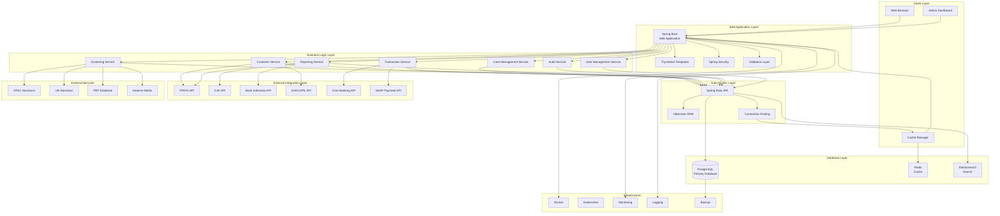
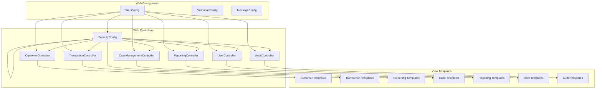
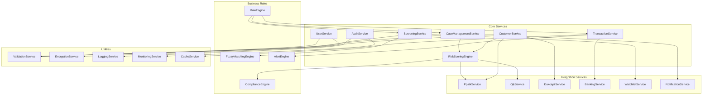
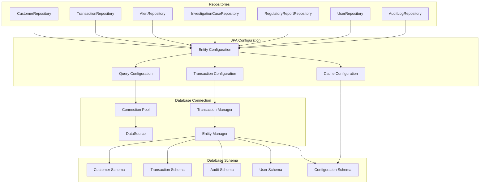
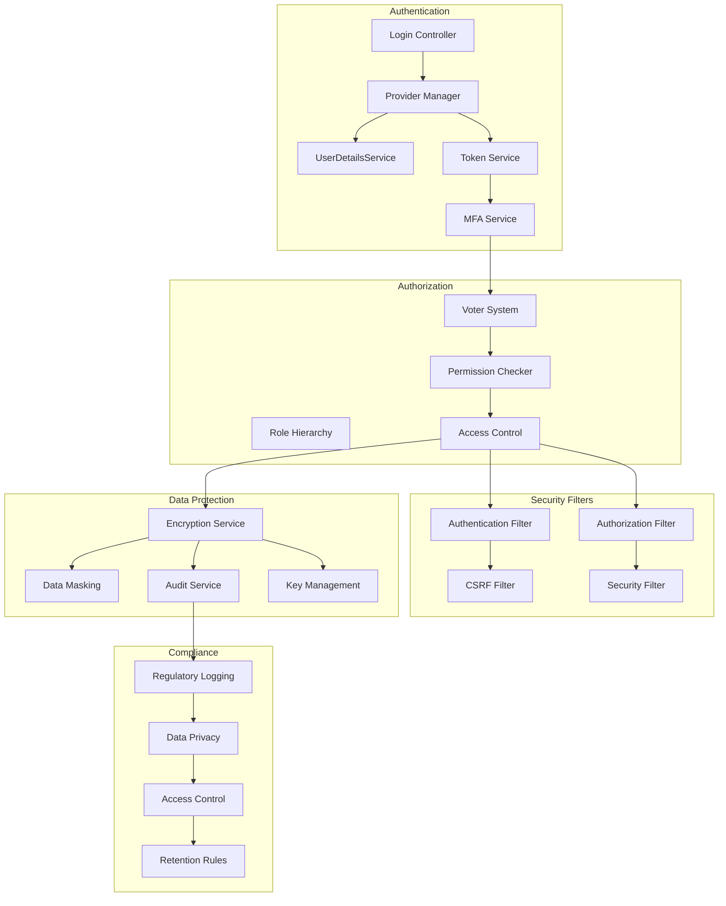
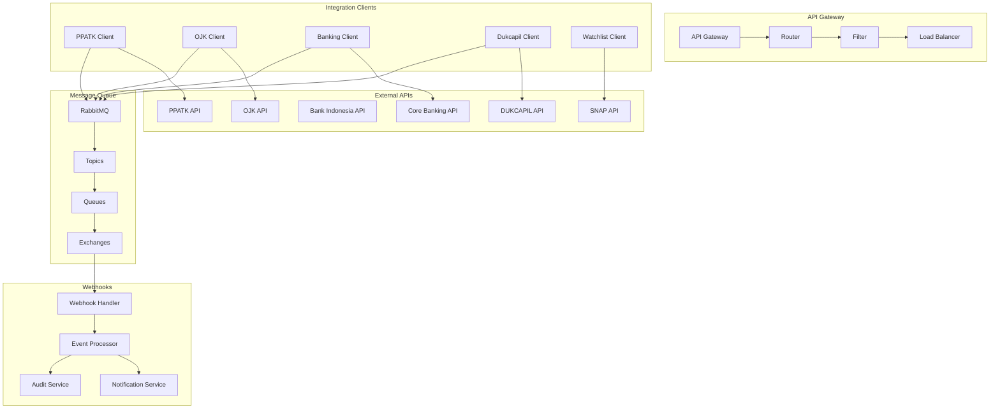
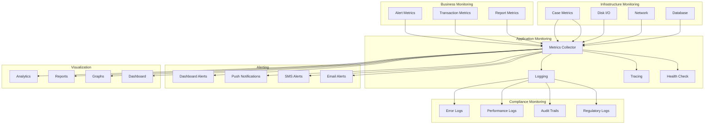
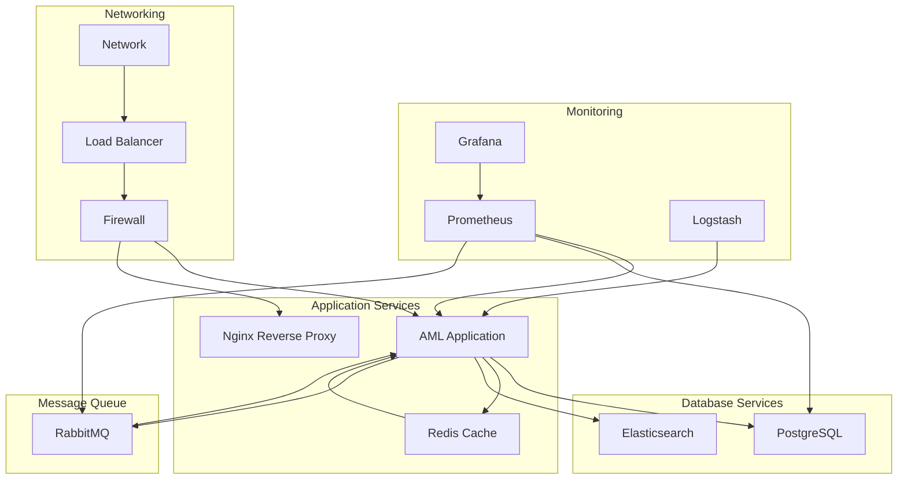

# AML Application - Architecture Overview

## High-Level Architecture

## Component Architecture

### 1. Presentation Layer (Spring MVC + Thymeleaf)

### 2. Service Layer Architecture

### 3. Data Access Layer Architecture

### 4. Security Architecture

### 5. Integration Architecture

### 6. Monitoring and Observability Architecture

## Deployment Architecture

### Docker Compose Configuration

This comprehensive architecture overview provides a detailed design for the AML application, covering all layers from presentation to infrastructure, with specific attention to Indonesian regulatory requirements and PPATK integration.