# AML Application - Class Diagram

```mermaid
classDiagram
    class AmlApplication {
        +main()
    }

    class CustomerController {
        +createCustomer(request)
        +updateCustomer(id, request)
        +getCustomer(id)
        +searchCustomers(criteria)
        +uploadDocument(customerId, file)
        +performDueDiligence(customerId)
    }

    class TransactionController {
        +monitorTransaction(transaction)
        +getTransactionAlerts()
        +investigateAlert(alertId)
        +getTransactionHistory(customerId)
        +blockTransaction(transactionId)
    }

    class ScreeningController {
        +screenCustomer(customerId)
        +screenTransaction(transaction)
        +updateWatchlists()
        +getScreeningResults(customerId)
        +manageFalsePositives(matchId)
    }

    class CaseManagementController {
        +createCase(alertId)
        +updateCase(caseId, request)
        +assignCase(caseId, officerId)
        +getCaseDetails(caseId)
        +closeCase(caseId, decision)
    }

    class ReportingController {
        +generateLTKM(caseId)
        +generateLTT(transaction)
        +submitToPPATK(report)
        +generateOJKReport(period)
        +getSubmissionStatus(reportId)
    }

    class CustomerService {
        +createCustomer(dto)
        +validateCustomerData(customer)
        +calculateRiskScore(customer)
        +classifyCustomerRisk(customer)
        +performEnhancedDueDiligence(customer)
        +updateCustomerProfile(customerId, updates)
    }

    class TransactionMonitoringService {
        +analyzeTransaction(transaction)
        +detectSuspiciousPatterns(transactions)
        +generateAlert(transaction, rule)
        +calculateTransactionRisk(transaction)
        +monitorCustomerBehavior(customerId)
        +checkThresholds(transaction)
    }

    class ScreeningService {
        +screenAgainstSanctions(customer)
        +screenAgainstPEP(customer)
        +screenAdverseMedia(customer)
        +performFuzzyMatching(name, watchlist)
        +updateScreeningResults(customerId, results)
        +calculateMatchConfidence(score)
    }

    class CaseManagementService {
        +createInvestigationCase(alert)
        +assignCaseOfficer(case, officer)
        +collectEvidence(caseId, evidence)
        +scheduleInterview(caseId, customer)
        +makeCaseDecision(caseId, decision)
        +escalateCase(caseId, reason)
    }

    class ReportingService {
        +prepareLTKMReport(case)
        +prepareLTTReport(transaction)
        +formatPPATKSubmission(report)
        +submitToRegulator(report, endpoint)
        +trackSubmissionStatus(reportId)
        +generateComplianceReport(period)
    }

    class AuditService {
        +logUserActivity(user, action, details)
        +logSystemEvent(component, event, details)
        +getAuditTrail(criteria)
        +generateAuditReport(period)
        +ensureDataIntegrity()
        +performForensicAnalysis(period)
    }

    class Customer {
        -Long id
        -String ktpNumber
        -String fullName
        -Date dateOfBirth
        -String placeOfBirth
        -String address
        -String phone
        -String email
        -String occupation
        -String sourceOfFunds
        -RiskLevel riskLevel
        -Date createdAt
        -Date updatedAt
        -Boolean isActive
        +getAge()
        +isPEP()
        +getRiskFactors()
    }

    class CustomerDocument {
        -Long id
        -Long customerId
        -DocumentType documentType
        -String fileName
        -String filePath
        -Date uploadDate
        -Date expiryDate
        -Boolean isVerified
        +isExpired()
        +getDocumentPath()
    }

    class Transaction {
        -Long id
        -String transactionId
        -Long customerId
        -BigDecimal amount
        -Currency currency
        -TransactionType type
        -Date transactionDate
        -String description
        -String sourceAccount
        -String destinationAccount
        -TransactionStatus status
        -GeographicInfo geographicInfo
        +isInternational()
        +isCashTransaction()
        +getAmountInIDR()
    }

    class Alert {
        -Long id
        -String alertId
        -Long customerId
        -AlertType type
        -AlertSeverity severity
        -String description
        -Date generatedAt
        -AlertStatus status
        -Long transactionId
        -String ruleTriggered
        +calculateRiskScore()
        +isHighPriority()
        +requiresImmediateAction()
    }

    class InvestigationCase {
        -Long id
        -String caseNumber
        -Long customerId
        -Long alertId
        -CaseStatus status
        -Long assignedOfficerId
        -Date createdDate
        -Date dueDate
        -Date closedDate
        -CaseDecision decision
        -String summary
        +isOverdue()
        +getDaysOpen()
        +requiresEscalation()
    }

    class CaseEvidence {
        -Long id
        -Long caseId
        -EvidenceType type
        -String fileName
        -String filePath
        -Date uploadedAt
        -String description
        -Long uploadedBy
        +getEvidencePath()
    }

    class ScreeningResult {
        -Long id
        -Long customerId
        -ScreeningType type
        -Boolean isMatch
        -Double confidenceScore
        -String matchedName
        -String watchlistName
        -Date screenedAt
        -Boolean isFalsePositive
        +isHighConfidence()
        +requiresManualReview()
    }

    class RegulatoryReport {
        -Long id
        -String reportNumber
        -ReportType type
        -ReportStatus status
        -Date generatedDate
        -Date submittedDate
        -String submissionId
        -String referenceNumber
        -Long caseId
        +isSubmitted()
        +getSubmissionStatus()
        +isOverdue()
    }

    class User {
        -Long id
        -String username
        -String email
        -String fullName
        -UserRole role
        -Department department
        -Boolean isActive
        -Date lastLogin
        -Boolean mfaEnabled
        +hasPermission(permission)
        +isComplianceOfficer()
        +canAccessSensitiveData()
    }

    class AuditLog {
        -Long id
        -String userId
        -String action
        -String objectType
        -String objectId
        -String details
        -Date timestamp
        -String ipAddress
        -String userAgent
        +getUserInfo()
        -getActionDetails()
    }

    class RiskAssessment {
        -Long id
        -Long customerId
        -RiskLevel overallRisk
        -Map~String, Double~ riskFactors
        -Date assessedDate
        -Long assessedBy
        -String methodology
        -Date nextReviewDate
        +calculateOverallRisk()
        +requiresEnhancedMonitoring()
        +getRiskFactors()
    }

    class WatchlistEntry {
        -Long id
        -String name
        -String entityType
        -List~String~ aliases
        -DateOfBirth dateOfBirth
        -String nationality
        -String watchlistType
        -Date addedDate
        -Date lastUpdated
        -Boolean isActive
        +matchWithCustomer(customer)
        +getAge()
    }

    class ComplianceRule {
        -Long id
        -String ruleName
        -String description
        -RuleType type
        -String condition
        -Double threshold
        -Boolean isActive
        -Date effectiveDate
        +evaluate(transaction)
        +isThresholdExceeded(transaction)
        +getDescription()
    }

    class DukcapilVerification {
        -Long id
        -Long customerId
        -String ktpNumber
        -VerificationStatus status
        -Date verifiedAt
        -String responseMessage
        -String dukcapilReference
        +isVerified()
        +getVerificationDetails()
    }

    class PpatkSubmission {
        -Long id
        -String submissionId
        -ReportType type
        -SubmissionStatus status
        -Date submittedAt
        -Date acknowledgedAt
        -String referenceNumber
        -String responseMessage
        +isAcknowledged()
        -getSubmissionDetails()
    }

    AmlApplication --> CustomerController
    AmlApplication --> TransactionController
    AmlApplication --> ScreeningController
    AmlApplication --> CaseManagementController
    AmlApplication --> ReportingController

    CustomerController --> CustomerService
    TransactionController --> TransactionMonitoringService
    ScreeningController --> ScreeningService
    CaseManagementController --> CaseManagementService
    ReportingController --> ReportingService

    CustomerService --> Customer
    CustomerService --> CustomerDocument
    CustomerService --> RiskAssessment
    CustomerService --> DukcapilVerification

    TransactionMonitoringService --> Transaction
    TransactionMonitoringService --> Alert
    TransactionMonitoringService --> ComplianceRule

    ScreeningService --> ScreeningResult
    ScreeningService --> WatchlistEntry
    ScreeningService --> Customer

    CaseManagementService --> InvestigationCase
    CaseManagementService --> CaseEvidence
    CaseManagementService --> Alert

    ReportingService --> RegulatoryReport
    ReportingService --> PpatkSubmission
    ReportingService --> InvestigationCase

    AuditService --> AuditLog
    AuditService --> User

    Customer "1" -- "*" CustomerDocument
    Customer "1" -- "*" Transaction
    Customer "1" -- "*" RiskAssessment
    Customer "1" -- "*" ScreeningResult
    Customer "1" -- "1" DukcapilVerification

    Transaction "1" -- "*" Alert
    Transaction "1" -- "*" RegulatoryReport

    Alert "1" -- "1" InvestigationCase
    InvestigationCase "1" -- "*" CaseEvidence

    User "1" -- "*" AuditLog
    User "1" -- "*" InvestigationCase

    RegulatoryReport "1" -- "1" PpatkSubmission

    WatchlistEntry "1" -- "*" ScreeningResult
```

## Class Description

### Controllers
- **CustomerController**: Handles customer onboarding, KYC, and due diligence
- **TransactionController**: Manages transaction monitoring and alert investigation
- **ScreeningController**: Orchestrates sanctions and PEP screening
- **CaseManagementController**: Manages investigation case workflows
- **ReportingController**: Handles regulatory reporting to PPATK and OJK

### Services
- **CustomerService**: Core customer management and risk assessment
- **TransactionMonitoringService**: Real-time transaction analysis and alert generation
- **ScreeningService**: Watchlist screening and fuzzy matching
- **CaseManagementService**: Investigation case workflow management
- **ReportingService**: Regulatory report preparation and submission
- **AuditService**: Comprehensive audit trail and forensic analysis

### Core Entities
- **Customer**: Individual and corporate customer profiles
- **Transaction**: Financial transaction records with geographic data
- **Alert**: Suspicious activity alerts with risk scoring
- **InvestigationCase**: Formal investigation cases with evidence management
- **ScreeningResult**: Sanctions and PEP screening outcomes
- **RegulatoryReport**: PPATK LTKM/LTT and OJK reports
- **User**: System users with role-based access control
- **AuditLog**: Complete audit trail for compliance

### Supporting Entities
- **RiskAssessment**: Customer risk classification and factors
- **WatchlistEntry**: Sanctions and PEP watchlist data
- **ComplianceRule**: Configurable monitoring rules
- **DukcapilVerification**: Indonesian ID verification
- **PpatkSubmission**: PPATK electronic filing tracking