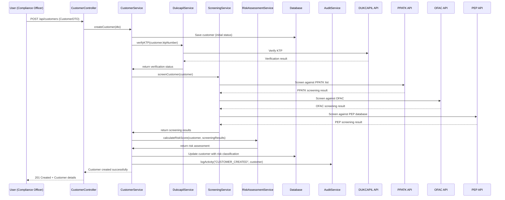
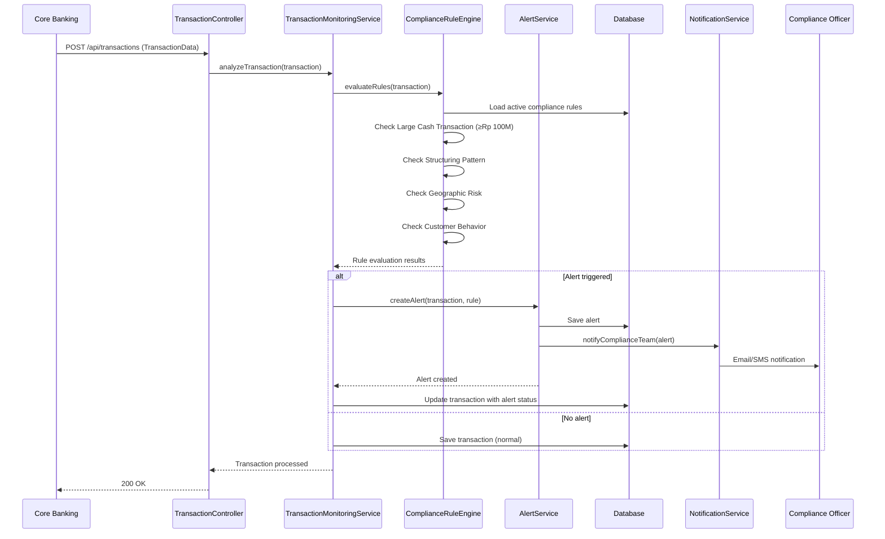
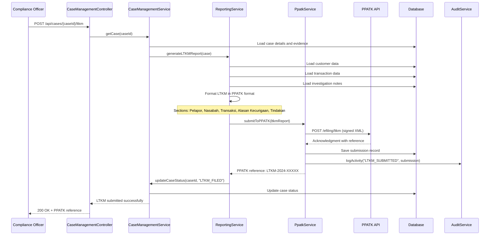
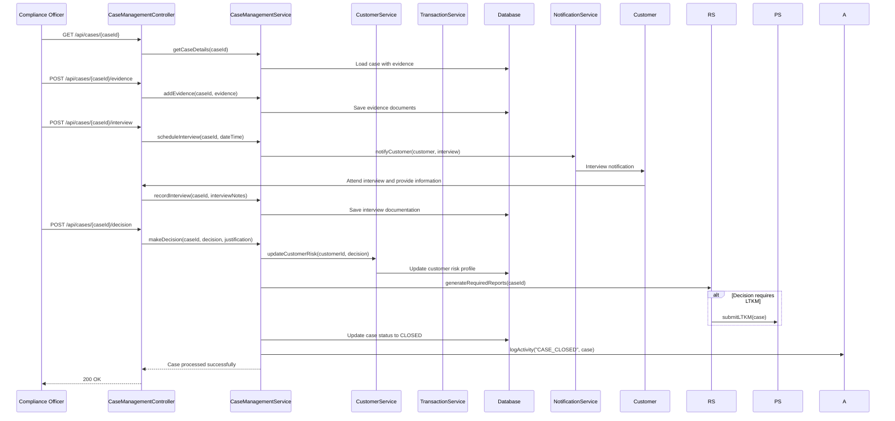
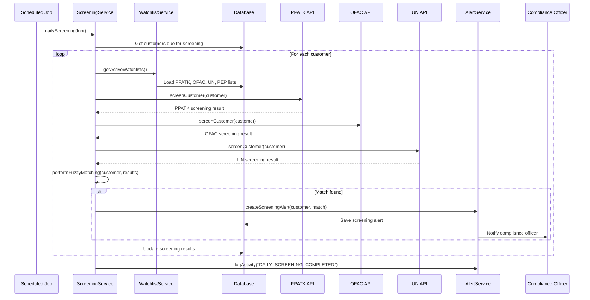
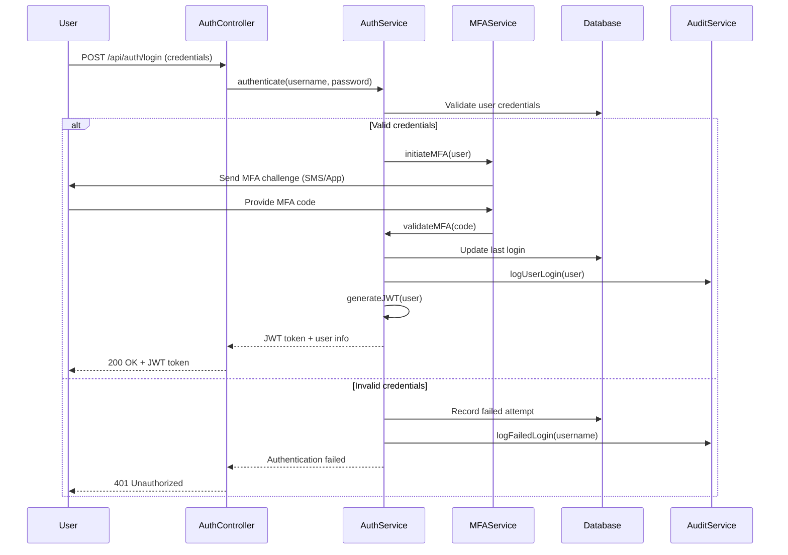
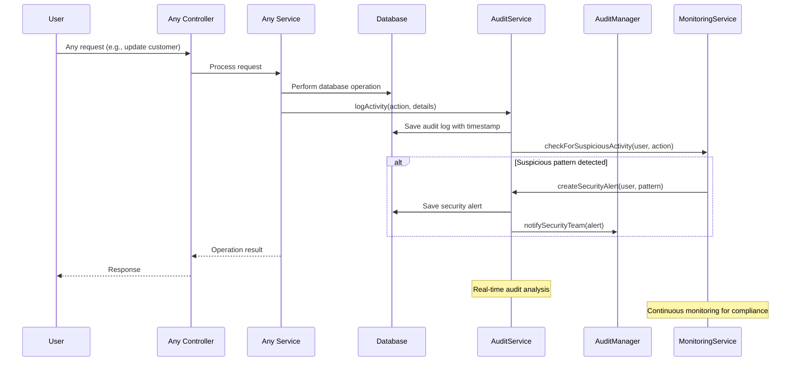
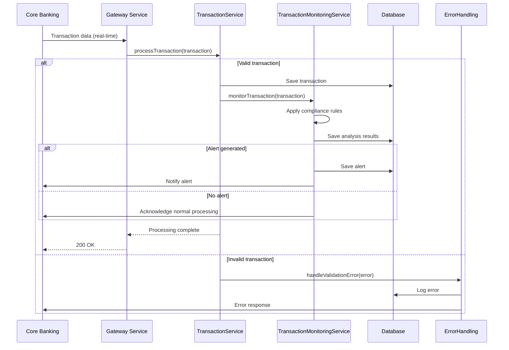

# AML Application - Sequence Diagrams

## 1. Customer Onboarding and Due Diligence Workflow

## 2. Transaction Monitoring and Alert Generation

## 3. LTKM Reporting to PPATK

## 4. Case Investigation Workflow

## 5. Sanctions Screening Process

## 6. User Authentication and Authorization

## 7. Audit Trail and Compliance Monitoring

## 8. Integration with Core Banking System

These sequence diagrams cover the key workflows in the AML application, focusing on Indonesian regulatory requirements and PPATK compliance processes. Each diagram shows the interaction between components, external systems, and the flow of data through the system.